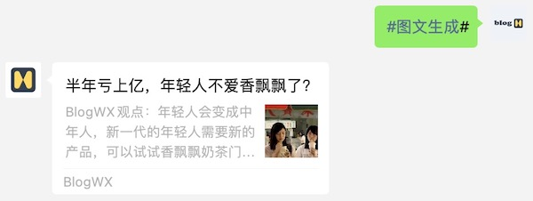

### 自定义图文


{: .m-5 }

### 自定义格式

1. 在公众号中输入格式命令`#注册#`进行注册。

	```
	#注册#昵称
	```


2. 在公众号中输入格式命令`#图文标题#`提交或更新标题。

	```
	#图文标题#标题内容
	```


3. 在公众号中输入格式命令`#图文描述#`提交或更新描述。

	```
	#图文描述#描述内容
	```


4. 在公众号中输入格式命令`#图片链接#`提交或更新链接。

	```
	#图片链接#链接内容
	```


5. 在公众号中输入格式命令`#图文链接#`提交或更新链接。

	```
	#图文链接#链接内容
	```

6. 在公众号中输入格式命令`#图文生成#`生成由标题、描述、图片、链接组成的图文消息。

	```
	#图文生成#
	```

